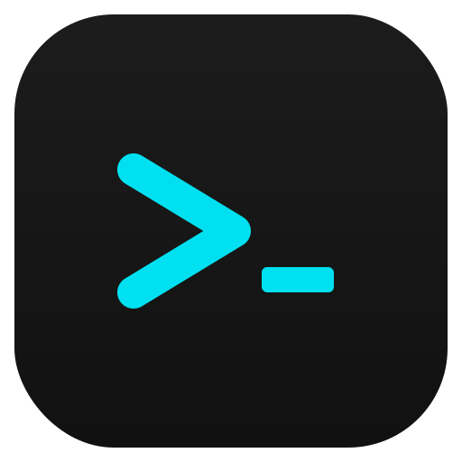
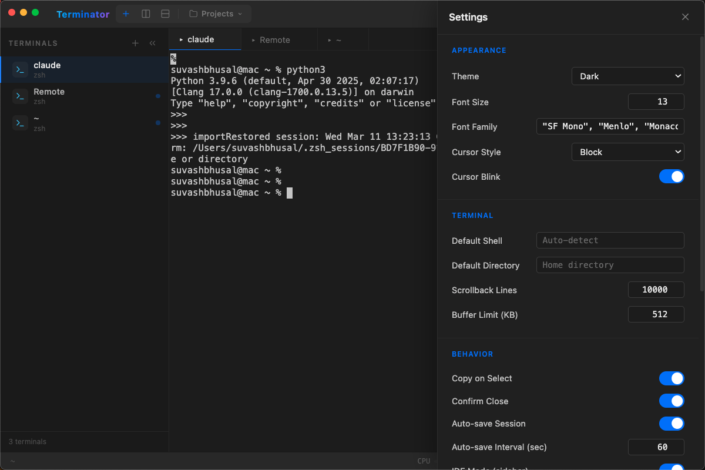

<p align="center">
  
</p>

<h1 align="center">Shellfire</h1>

<p align="center">
  <strong>AI-powered terminal multiplexer</strong><br>
  Split, organize, and supercharge your terminal workflow — with Claude intelligence built in.
</p>

<p align="center">
  <a href="https://github.com/suvash-glitch/Shellfire/releases"></a>
  <a href="LICENSE"></a>
  
  
</p>

<p align="center">
  
</p>

---

## Why Shellfire?

Shellfire replaces your terminal, tmux, and half your DevOps dashboard. It gives you a modern, GPU-accelerated terminal multiplexer with AI autocomplete, an IDE-style sidebar, Docker management, SSH bookmarks, and a full CLI — all in one Electron app that feels native.

---

## Features

**Terminal Multiplexing** — Horizontal/vertical splits, tabs, flexible grid layout with drag-to-resize. Zoom any pane to fullscreen and back.

**AI Autocomplete & Chat** — Claude-powered ghost text suggestions as you type. Launch Claude Code sessions directly from any pane for inline AI assistance.

**IDE Mode** — Toggle a sidebar with project grouping, editor-style tabs, and single-pane focus. Think VS Code's terminal, but it *is* the whole app.

**Command Palette** — `Cmd+P` opens a searchable palette for every action: switch panes, change themes, open SSH bookmarks, run snippets, and more.

**Session Save & Restore** — Save your entire workspace (layout, working directories, scroll history) and restore it on next launch. Auto-save runs in the background.

**SSH Bookmarks & Remote Discovery** — Save SSH connections, manage them from the UI, and discover running tmux/screen sessions on remote hosts.

**6 Built-in Themes** — Dark, Solarized Dark, Dracula, Monokai, Nord, and Light. Cycle with a single shortcut.

**CLI with Zsh Completion** — Control Shellfire from any shell: create, list, attach, send commands, kill sessions. Full Zsh tab completion included.

**Broadcast Mode** — Send keystrokes to every pane simultaneously. Ideal for configuring multiple servers at once.

**Command Bookmarks & Snippets** — Save and organize frequently used commands. Recall them instantly from the command palette.

**Port Manager** — View listening ports, identify processes, and kill them from a built-in UI.

**Docker UI** — List running containers with status, image, and uptime at a glance.

**System Monitoring** — Per-pane CPU, memory, and disk usage indicators. Git branch and status display in the pane header.

**Pipeline Runner & Cron Manager** — Define and run multi-step command pipelines. View and manage cron jobs visually.

**Keyword Watchers** — Set alerts on terminal output. Get notified when a build finishes, a test fails, or a specific pattern appears.

**Scratchpad & Notes** — Built-in notepad for jotting down commands, TODOs, or debug notes without leaving the terminal.

---

## Installation

### Homebrew (macOS)

```bash
brew install --cask shellfire-terminal
```

### Download

Grab the latest DMG, EXE, or AppImage from [GitHub Releases](https://github.com/suvash-glitch/Shellfire/releases).

### Build from Source

```bash
git clone https://github.com/suvash-glitch/Shellfire.git
cd Shellfire
npm install
npm run rebuild   # rebuild native modules (node-pty)
npm start
```

To build distributable packages:

```bash
npm run build         # macOS (.dmg, .zip)
npm run build:win     # Windows (.exe, .zip)
npm run build:linux   # Linux (.AppImage, .deb)
```

---

## Quick Start

1. **Launch Shellfire** — a single terminal pane opens.
2. **Split** — `Cmd+D` splits right, `Cmd+Shift+D` splits down.
3. **Navigate** — `Cmd+Arrow` moves between panes, `Cmd+1-9` jumps directly.
4. **Command Palette** — `Cmd+P` to search and run any action.
5. **Save your workspace** — `Cmd+Shift+S` saves the full session. It auto-restores on next launch.
6. **Enable AI** — Open Settings, add your Anthropic API key, and toggle AI Autocomplete.

---

## Keyboard Shortcuts

| Shortcut | Action |
|---|---|
| `Cmd+T` | New tab |
| `Cmd+Shift+T` | New tab (same directory) |
| `Cmd+D` | Split right |
| `Cmd+Shift+D` | Split down |
| `Cmd+W` | Close pane |
| `Cmd+P` | Command palette |
| `Cmd+F` | Find in terminal |
| `Cmd+Shift+F` | File finder |
| `Cmd+K` | Clear terminal |
| `Cmd+Shift+Enter` | Zoom / unzoom pane |
| `Cmd+Shift+B` | Toggle broadcast mode |
| `Cmd+Shift+R` | Open snippets |
| `Cmd+Shift+S` | Save session |
| `Cmd+;` | Quick command bar |
| `Cmd+1` - `Cmd+9` | Jump to pane |
| `Cmd+Arrow` | Navigate between panes |
| `Cmd+=` / `Cmd+-` | Increase / decrease font size |
| `Cmd+Shift+L` | Toggle pane lock |
| `Ctrl+Shift+T` | Cycle theme |

> On Windows and Linux, substitute `Ctrl` for `Cmd`.

---

## CLI Usage

Shellfire includes a CLI for scripting and external control:

```bash
shellfire list                             # List all sessions
shellfire new -t backend -d ~/projects/api # Create named session
shellfire attach -t backend                # Focus a session
shellfire send -t backend "npm start"      # Send input to a session
shellfire rename -t backend "API Server"   # Rename a session
shellfire kill -t backend                  # Kill a session
shellfire remote user@host -p 22           # Discover remote sessions
```

### Zsh Completion

Copy the completion file to your Zsh completions directory:

```bash
cp bin/_shellfire ~/.zsh/completions/_shellfire
# Then reload: exec zsh
```

---

## Configuration

Settings are stored in your OS user data directory:

| File | Contents |
|---|---|
| `config.json` | Theme, font size, preferences |
| `session.json` | Saved workspace layout and pane state |
| `snippets.json` | Command snippets |
| `profiles.json` | Saved layout profiles |
| `settings.json` | App settings (AI keys, auto-save interval, etc.) |

**Location:**
- macOS: `~/Library/Application Support/shellfire/`
- Windows: `%APPDATA%/shellfire/`
- Linux: `~/.config/shellfire/`

---

## Tech Stack

- **Electron** v35 with context-isolated renderer
- **xterm.js** v5.4 with WebGL acceleration, search, fit, and web-links addons
- **node-pty** for native PTY management
- **electron-builder** for cross-platform packaging
- **electron-updater** for auto-updates

---

## Contributing

See [CONTRIBUTING.md](CONTRIBUTING.md) for development setup, code style, and PR guidelines.

---

## Security

See [SECURITY.md](SECURITY.md) for reporting vulnerabilities and security considerations.

---

## License

[MIT](LICENSE) &copy; Suvash Bhusal
